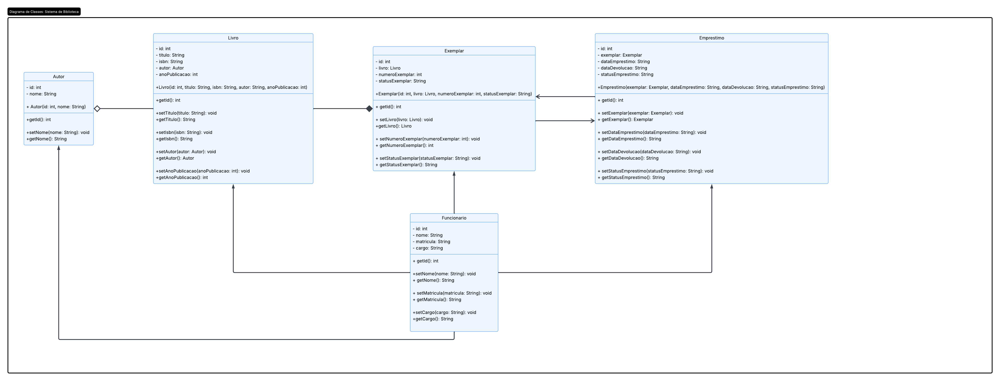

## Atividade 2 - Resposta

---

composição: o livro para o exemplar não existe um exemplar sem livro. \\
agregação: o livro para o autor, o livro é uma parte do todo que é o autor. \\

A classe emprestimo está associado ao exemplar e vice-versa pois temos que saber a situação antes de emprestarmos e se foi devolvido, para emprestarmos novamente. \\

A classe funcionario está associado a tudo isso por isso está ligada a todos.

> Imagem

